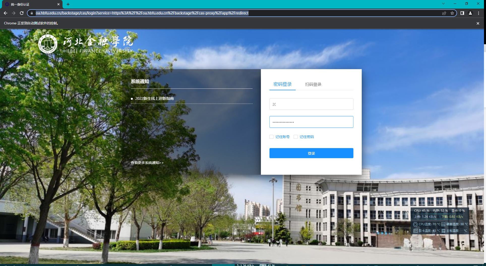
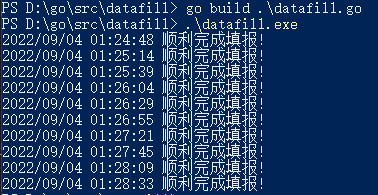
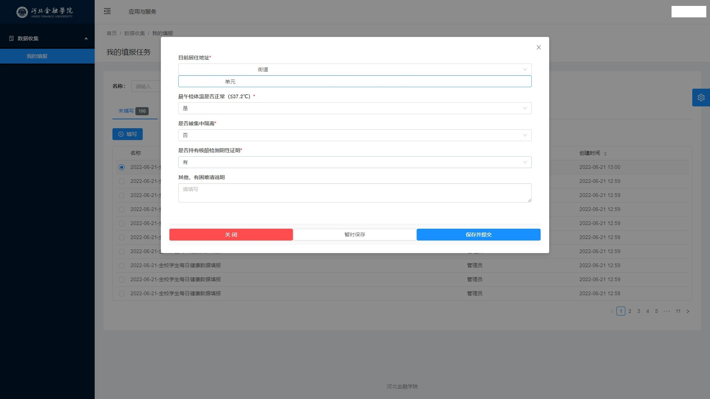

# dataFill_old
河北金融学院每日自动健康打卡（旧版）

使用方法：填写 const 字段后编译，写完了才发现从 2022-06-22 开始不再使用本接口，所以就不放详细使用教程了，有使用问题请发 Issues ，可以回答使用上的问题

新版适配已经完成， 2022-06-22 之后的打卡请前往：https://github.com/HBFUer/dataFill_new

运行截图

- 调试模式下运行情况

- 终端运行

- 自动填写好了会生成截图

